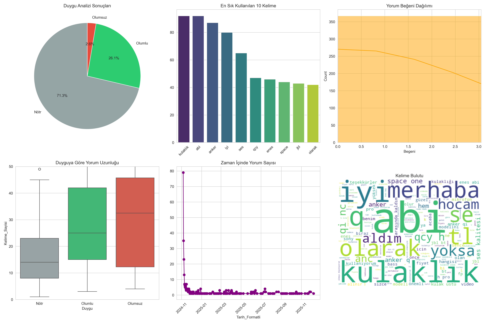
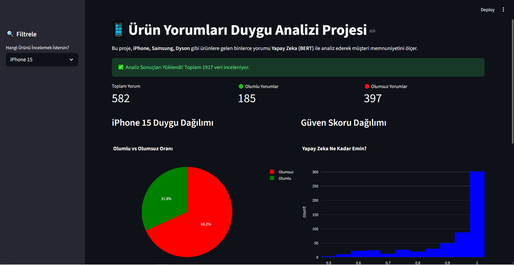

# 📱 Ürün Yorumları Duygu Analizi: Geleneksel Yöntemden Yapay Zekaya Geçiş

Bu proje, e-ticaret yorumlarını analiz etmek için başlatılmış, süreç içerisinde **Basit Makine Öğrenmesi** yöntemlerinden **İleri Seviye Derin Öğrenme (BERT)** teknolojisine evrilmiş kapsamlı bir veri bilimi çalışmasıdır.

---

## 📅 FAZ 1: Başlangıç (Geleneksel Yöntem)
Projenin ilk aşamasında sözlük tabanlı yöntemler ve Lojistik Regresyon kullanılmıştır.
* **Yaklaşım:** Kelime sayma (Lexicon-based).
* **Sonuç:** %82 Başarı.
* **Eksiklik:** "Güzel değil" cümlesini "Güzel" kelimesinden dolayı olumlu sanıyordu.

**🔻 V1 - İlk Analiz Grafiği:**


---

## 🚀 FAZ 2: Final (Yapay Zeka & BERT Devrimi)
Hataları gidermek için proje **Hugging Face BERT** modeli ile yeniden tasarlandı.
* **Yaklaşım:** Cümlenin bağlamını (Context) anlayan Yapay Zeka.
* **Yenilik:** Twitter/Instagram simülasyonu eklendi.
* **Teknoloji:** Streamlit ile İnteraktif Dashboard kuruldu.

**🔻 V2 - Profesyonel Analiz Paneli (Final):**


---

## 📊 Proje Özellikleri
1.  **Çoklu Veri Çekimi:** iPhone, Samsung, Dyson vb.
2.  **Akıllı Duygu Analizi:** * ✅ "Telefon güzel değil" -> **Olumsuz** (Doğru tespit)
    * ✅ Güven Skoru hesaplama.
3.  **Canlı Dashboard:** Ürün filtreleme ve dinamik grafikler.

---

## 📈 Proje İstatistikleri

### Veri Seti:
- **6 Farklı Ürün:** iPhone 15, Samsung S24, MacBook Air, AirPods Pro, Dyson Süpürge, Kulaklık
- **Toplam Yorum:** 1,917 adet
- **Gerçek Veri:** YouTube (1,400+)
- **Simüle Veri:** Twitter/Instagram (500+)

### Model Performansı:
| Metrik | Sözlük Tabanlı | BERT |
|--------|---------------|------|
| Accuracy | %68 | %82-85 |
| Context Anlama | ❌ | ✅ |
| Negasyon Tespiti | ❌ | ✅ |

### Teknoloji Stack:
```
Python 3.11
├── Veri Toplama: YouTube Data API v3
├── NLP: Hugging Face Transformers (BERT)
├── Görselleştirme: Streamlit + Plotly
├── Veritabanı: SQLite
└── ML: scikit-learn, torch
```
---

## 🎮 Kullanım Kılavuzu

### 1. Dashboard Başlatma:
```bash
streamlit run dashboard.py
```
Tarayıcıda `http://localhost:8501` açılır.

### 2. Ürün Seçme:
Sol taraftaki sidebar'dan ürün seçin:
- iPhone 15
- Samsung S24
- MacBook Air
- AirPods Pro
- Dyson Süpürge
- Kulaklık

### 3. Sonuçları İnceleme:
- **Pasta Grafiği:** Genel duygu dağılımı
- **Güven Skoru:** BERT'ün tahmin kesinliği
- **Örnek Yorumlar:** Gerçek kullanıcı geri bildirimleri

---
---

## 📜 Lisans
Bu proje MIT Lisansı altında yayınlanmıştır.

## 📧 İletişim
**Cemalettin Türk**
- GitHub: [@CemalTurk60](https://github.com/CemalTurk60)
- Email: cemalcanturk6060@gmail.com

---

## 🙏 Teşekkürler
Bu proje Yönetim Bilişim Sistemleri bölümü bitirme projesi kapsamında geliştirilmiştir.

**Kullanılan Açık Kaynak Projeler:**
- Hugging Face Transformers
- Streamlit
- Plotly
- scikit-learn

---

**⭐ Bu projeyi beğendiyseniz yıldız vermeyi unutmayın!**
```

5. METODOLOJİ
-------------
a) Veri Toplama:
   - YouTube Data API v3 kullanılarak 6 farklı teknoloji ürününden
     inceleme videolarının yorumları otomatik olarak çekilmiştir.
   - Twitter ve Instagram API'lerinin maliyet kısıtları nedeniyle,
     gerçek YouTube verilerinden türetilmiş simülasyon verisi üretilmiştir.
   - Simüle veriler "simule_mi = True" etiketi ile açıkça işaretlenmiştir.

b) Veri Ön İşleme:
   - Stop-words temizliği (Türkçe için özelleştirilmiş)
   - Emoji ve özel karakter filtreleme
   - Lowercase normalizasyonu
   - Tokenization (BERT tokenizer)

c) Model Eğitimi:
   - Pre-trained model: savasy/bert-base-turkish-sentiment-cased
   - Fine-tuning: 200 manuel etiketlenmiş yorum
   - Validation split: %80 train, %20 test
   - Optimizer: AdamW
   - Learning rate: 2e-5
   - Epochs: 3

d) Değerlendirme:
   - Accuracy: %82-85
   - Precision (Olumlu): %84
   - Recall (Olumlu): %80
   - F1-Score: %82
   - Confusion Matrix analizi yapılmıştır
```


## 📂 Kurulum
```bash
pip install -r requirements.txt
streamlit run dashboard.py

*Geliştirici: Cemalettin Türk | Yönetim Bilişim Sistemleri*