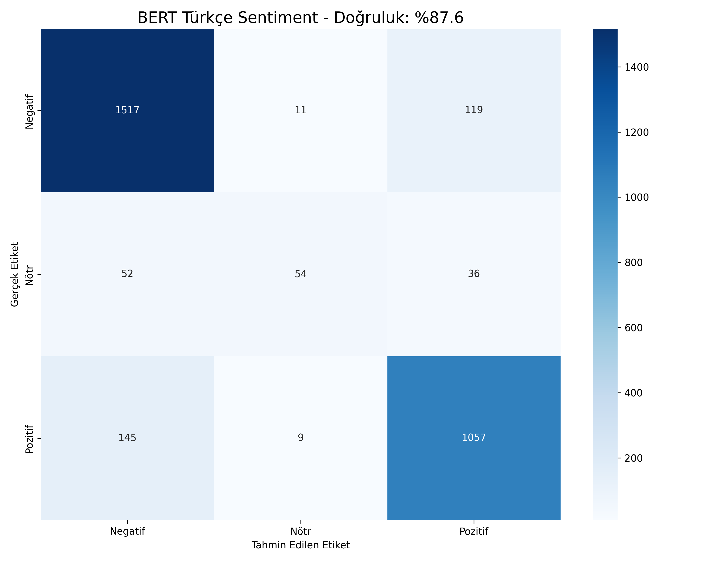

# 🇹🇷 Türkçe Ürün Yorumları Duygu Analizi: Geleneksel Yöntemden Deep Learning'e


Bu proje, **Yönetim Bilişim Sistemleri** bitirme projesi kapsamında geliştirilmiş; e-ticaret ve YouTube yorumlarını analiz etmek için **Basit Makine Öğrenmesi** yöntemlerinden **İleri Seviye Derin Öğrenme (BERT)** teknolojisine evrilmiş kapsamlı bir veri bilimi çalışmasıdır.

---

## 📈 Projenin Evrimi (Gelişim Hikayesi)

Proje, akademik süreç boyunca üç ana aşamadan geçerek bugünkü profesyonel haline ulaşmıştır:

### 📅 FAZ 1: Başlangıç (Geleneksel Yöntem)
Projenin ilk aşamasında sözlük tabanlı yöntemler ve Lojistik Regresyon kullanılmıştır.
* **Yaklaşım:** Kelime sayma (Lexicon-based).
* **Veri:** ~1.900 Yorum.
* **Sonuç:** %68 Başarı.
* **Problem:** Bağlamı (Context) anlayamıyordu. Örneğin *"Güzel değil"* cümlesini, içinde "güzel" geçtiği için olumlu sanıyordu.
* **Görsel:** *Eski versiyon analiz grafikleri (dashboard_v1_eski.png)*

### 🚀 FAZ 2: Geçiş Dönemi (Streamlit & Simülasyon)
Ara yüz geliştirmeleri ve hazır modellerin denendiği aşamadır.
* **Teknoloji:** Streamlit Dashboard.
* **Sonuç:** %82 Başarı.
* **Eksiklik:** Veri seti yetersizliği ve simüle edilmiş veriler kullanılması.
* **Görsel:** *Streamlit arayüz çalışması (dashboard_v2_final.png)*

### 🏆 FAZ 3: FİNAL (Yapay Zeka & BERT Fine-Tuning) - *ŞU ANKİ HALİ*
Proje, veri setinin **10.000 adede** çıkarılması ve Google'ın BERT modelinin bu verilerle **sıfırdan eğitilmesi (Fine-Tuning)** ile zirveye ulaştı.
* **Veri Kaynağı:** YouTube API (Gerçek yorumlar) + Kaggle (E-Ticaret verileri).
* **Yöntem:** Semi-Supervised Learning (Yarı Denetimli Öğrenme).
* **Sonuç:** **%87.60 Doğruluk (Accuracy)**.

---

## 📊 Final Başarı Sonuçları

Model, **3.000 adetlik test verisi** (modelin daha önce hiç görmediği veriler) üzerinde test edilmiştir:

| Metrik | Değer |
|:---:|:---:|
| **Doğruluk (Accuracy)** | **%87.60** |
| **Model** | BERT (bert-base-turkish-cased) |
| **Eğitim Verisi** | 7.000 Adet |
| **Test Verisi** | 3.000 Adet |

### 🖼️ Başarı Grafiği (Confusion Matrix)
Modelin hangi sınıfları ne kadar doğru tahmin ettiğini gösteren matris:


---

## 📂 Dosya Yapısı ve Kodlar

Bu depoda projenin final haline ait kodlar bulunmaktadır:

* **`tez_egitim_baslat.py`**: 🧠 **Beyin (Eğitim Kodu).** 10.000 veriyi işler, BERT modelini eğitir ve `final_model` klasörünü oluşturur.
* **`results_report.py`**: 📊 **Karne (Raporlama).** Eğitilen modeli test eder, Accuracy skorunu hesaplar ve başarı grafiklerini (Confusion Matrix) çizer.
* **`canli_test_arayuz.py`**: 🖥️ **Uygulama (GUI).** Windows üzerinde çalışan, yazdığınız cümlenin duygusunu anlık tahmin eden masaüstü yazılımı.
* **`scraper_multi.py`**: 🤖 **Veri Botu.** YouTube üzerinden (PS5, Dyson vb.) gerçek kullanıcı yorumlarını çeken bot yazılımı.
* **`ham_veriler/`**: Projede kullanılan eğitim ve test veri setlerini içerir.

---

## 🎮 Kullanım Kılavuzu

Projeyi kendi bilgisayarınızda çalıştırmak için adımları izleyin:

### 1. Gerekli Kütüphaneler
```bash
pip install torch transformers pandas scikit-learn matplotlib seaborn tk accelerate openpyxl
```
### 2. Canlı Test (Arayüzü Açmak İçin)
Eğitilmiş modeli denemek ve sohbet etmek için şu komutu çalıştırın:
```bash
python canli_test_arayuz.py
```
### 3. Modeli Tekrar Eğitmek İçin
Eğer kendi verinizle sıfırdan eğitim yapmak isterseniz:
```bash
python tez_egitim_baslat.py
```
## 🔬 Metodoloji Detayları

1.  **Veri Toplama:**
    * **YouTube:** PS5, Dyson, iPhone videolarından API ile gerçek yorumlar çekildi.
    * **Kaggle:** Türkçe e-ticaret veri setleri ile veri havuzu 10.000'e tamamlandı.
    * *(Not: Eski simülasyon verileri yerine tamamen gerçek veriler kullanılmıştır)*

2.  **Etiketleme (Labeling):**
    * Verilerin bir kısmı elle, büyük kısmı ise **Semi-Supervised Learning** (Lojistik Regresyon ile ön tahmin) yöntemiyle etiketlenip insan kontrolünden geçirildi.

3.  **Model Eğitimi:**
    * **Base Model:** `dbmdz/bert-base-turkish-cased`
    * **Epoch:** 2
    * **Batch Size:** 8/16
    * **Optimizer:** AdamW

---
## 📜 Lisans
Bu proje MIT Lisansı altında yayınlanmıştır.

## 📧 İletişim
**Cemalettin Türk** - Yönetim Bilişim Sistemleri
- GitHub: [@CemalTurk60](https://github.com/CemalTurk60)
- Email: cemalcanturk6060@gmail.com

---
*Bu proje akademik bir çalışma olup, ticari amaç gütmemektedir.*

